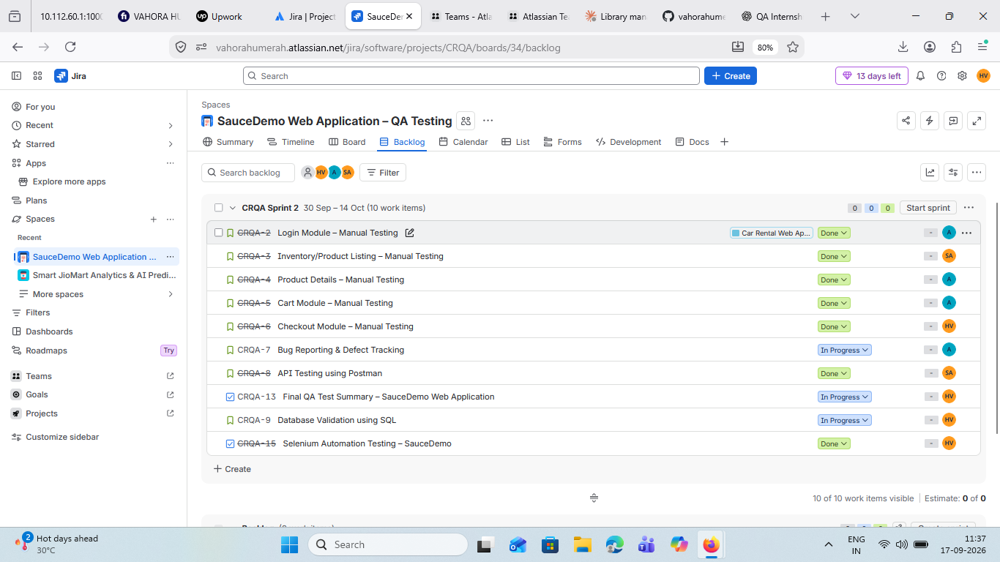
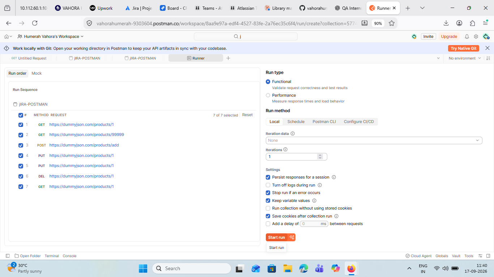
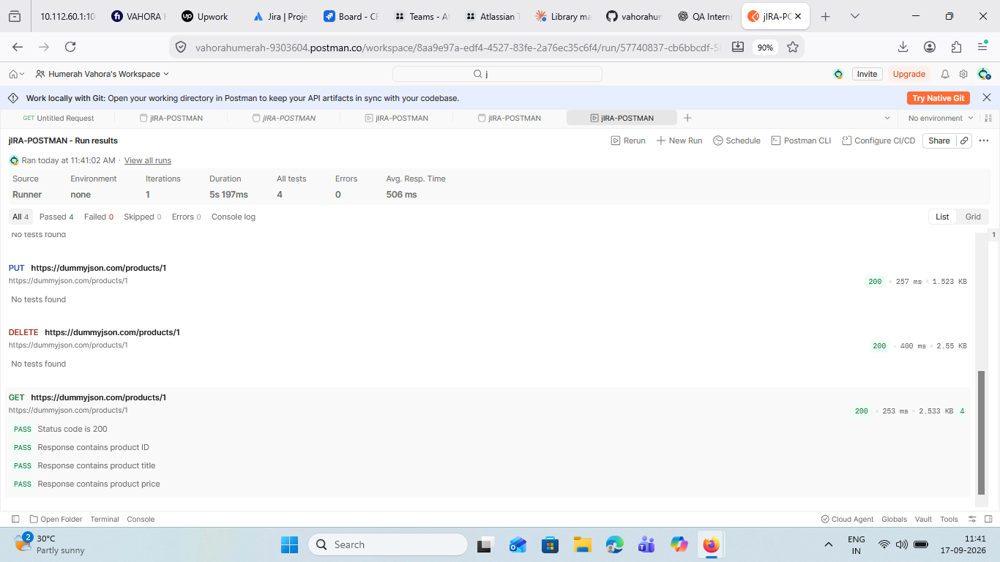

# 🧪 SauceDemo QA Testing

## 📌 Project Overview

**SauceDemo QA Testing** is a practical Quality Assurance project based on the **SauceDemo web application**. The project demonstrates a structured QA workflow covering **Manual Testing, API Testing, Database Validation Documentation, Defect Tracking, Jira Project Management, and Selenium Automation**.

The project activities were planned, documented, executed, and tracked using **Jira, Postman, Python, Selenium WebDriver, Microsoft Excel, SQL validation concepts, Git, and GitHub**.

---

## 🌐 Application Under Test

**Application:** SauceDemo  
**URL:** [https://www.saucedemo.com/](https://www.saucedemo.com/)

SauceDemo is a demo e-commerce web application used for software testing and automation practice.

---

## 🛠️ Tools & Technologies

| Tool / Technology | Purpose |
|---|---|
| **Jira** | QA task tracking, workflow management, defect tracking, and project management |
| **Postman** | API testing and response validation |
| **Python** | Test automation programming |
| **Selenium WebDriver** | Web UI automation |
| **Microsoft Excel** | Test case documentation |
| **SQL** | Database validation concepts and documentation |
| **Git & GitHub** | Version control and project documentation |
| **Google Chrome** | Browser testing |

---

# 🎯 QA Activities

This project covers the following QA activities:

- **Manual Functional Testing**
- **Test Case Design and Documentation**
- **UI Validation**
- **API Testing using Postman**
- **Database Validation Documentation**
- **Defect Identification and Tracking**
- **Jira Workflow Management**
- **Selenium WebDriver Automation**
- **End-to-End Testing**
- **Test Execution and Reporting**

---

# 🧪 Manual Testing

Manual testing was performed on the major functional modules of the SauceDemo application.

## Login Module

Test scenarios included:

- Valid login
- Invalid credentials
- Blank username validation
- Password validation
- Login functionality
- Validation message verification

## Inventory / Product Listing

Test scenarios included:

- Product display verification
- Product name validation
- Product image validation
- Product price validation
- Add to Cart functionality
- Product sorting validation

## Product Details

Test scenarios included:

- Product details page navigation
- Product name verification
- Product image verification
- Product description verification
- Product price verification
- Add to Cart from product details

## Cart Module

Test scenarios included:

- Cart page navigation
- Added product verification
- Product name and price validation
- Quantity validation
- Remove product functionality
- Continue Shopping functionality

## Checkout Module

Test scenarios included:

- Checkout page validation
- Customer information fields
- Required field validation
- Valid customer information
- Order overview validation
- Order placement confirmation

---

# 🔌 API Testing with Postman

API testing was performed using the **DummyJSON Products API** through Postman.

## API Scenarios

- **GET** request with a valid product ID
- **GET** request with an invalid product ID
- **POST** request to create a product
- **PUT** request to update a product
- **DELETE** request to delete a product
- API response and field validation

## API Validation

The API validation included:

- HTTP status code verification
- Product ID verification
- Product title verification
- Product price verification

The Postman execution evidence included in this repository shows **4 tests passed, 0 failed, and 0 errors** for the executed validation tests.

---

# 🗄️ Database Validation

Database validation scenarios were documented using SQL-based QA testing concepts.

The documented scenarios cover:

- Database connection validation
- Table existence verification
- `SELECT` query validation
- `WHERE` condition validation
- `INSERT` operation
- `UPDATE` operation
- `DELETE` operation
- Record count validation

> **Note:** This section represents QA documentation and validation scenarios prepared for practice. Direct database access to the SauceDemo application was not available.

---

# 🐞 Defect Tracking

Defect tracking and validation activities were managed using **Jira**.

The workflow included:

- Defect identification
- Defect validation
- Issue tracking
- Status management
- Test execution tracking

Observed application behavior was validated before being considered a defect. Expected validation messages were not reported as bugs.

---

# 📋 Jira Project Management

The QA workflow was organized and tracked using **Jira**.

The Jira project contains work related to:

- Login Testing
- Inventory Testing
- Product Details Testing
- Cart Testing
- Checkout Testing
- API Testing
- Database Validation
- Defect Tracking
- Final QA Summary
- Selenium Automation

## Jira Project Evidence

### Jira Summary Dashboard


### Jira Backlog



---

# 🤖 Selenium Automation

A separate automation project was developed using **Python and Selenium WebDriver**.

The automation covers the end-to-end SauceDemo workflow:

```text
Login
  ↓
Inventory
  ↓
Add Product to Cart
  ↓
Shopping Cart
  ↓
Checkout
  ↓
Customer Information
  ↓
Order Overview
  ↓
Place Order
  ↓
Order Confirmation
```

## Automated Scenarios

- Login Test
- Inventory Test
- Add to Cart Test
- Cart Test
- Checkout Test
- Order Placement Test

The implemented Selenium automation scenarios were executed successfully.

## 🔗 Selenium Automation Repository

[**SauceDemo Selenium Automation – GitHub**](https://github.com/vahorahumerah/SauceDemo-Selenium-Automation)

---

# 📸 API Testing Evidence

### Postman Collection Runner



### Postman Test Results



These screenshots provide evidence of API request execution and response validation.

---

# 🔄 QA Workflow

The overall QA workflow followed this structure:

```text
Requirement Understanding
        ↓
Test Scenario Design
        ↓
Manual Functional Testing
        ↓
API Testing
        ↓
Database Validation Documentation
        ↓
Defect Identification & Tracking
        ↓
Selenium Automation
        ↓
Test Execution
        ↓
QA Documentation & Reporting
```

---

# 📊 QA Coverage

| QA Area | Work Performed |
|---|---|
| **Manual Testing** | Functional testing of SauceDemo modules |
| **API Testing** | GET, POST, PUT, DELETE and response validation |
| **Database Validation** | SQL validation scenarios documented |
| **Defect Tracking** | Jira-based issue and defect tracking |
| **Selenium Automation** | End-to-end browser automation using Python |
| **Jira Management** | Work items, workflow, execution tracking, and documentation |
| **Documentation** | Test cases, results, screenshots, and project evidence |

---

# 🧠 Skills Demonstrated

## QA & Testing

- Functional Testing
- Manual Testing
- Test Case Design
- Test Execution
- End-to-End Testing
- UI Validation
- Defect Identification
- Defect Tracking
- QA Documentation

## API Testing

- REST API Testing
- GET / POST / PUT / DELETE
- HTTP Status Code Validation
- Response Field Validation
- Postman Collection Execution

## Automation

- Python
- Selenium WebDriver
- Web Element Locators
- Explicit Waits
- Expected Conditions
- Assertions
- End-to-End Browser Automation

## Tools

- Jira
- Postman
- Git
- GitHub
- Visual Studio Code
- Microsoft Excel
- Google Chrome

---

# 📂 Repository Structure

```text
SauceDemo-QA-Testing/
│
├── Jira-Screenshots/
│   ├── 01-Jira-Summary-Dashboard.png
│   ├── 02-Jira-Backlog.png
│   ├── 03-Postman-API-Runner.png
│   └── 04-Postman-Test-Results.png
│
└── README.md
```

---

# 🚀 Related Project

For the Selenium WebDriver automation source code:

🔗 [**SauceDemo Selenium Automation – GitHub**](https://github.com/vahorahumerah/SauceDemo-Selenium-Automation)

The separate repository contains the Python Selenium automation scripts and automation documentation.

---

# 📌 Project Status

**QA Portfolio Project**

This project demonstrates practical experience with a structured QA workflow using **Jira, Manual Testing, Postman, SQL validation concepts, Selenium WebDriver, Python, Git, and GitHub**.

---

# 👩‍💻 Author

## Humerah Vahora

**B.Tech Information Technology**  
**Anand Agricultural University, Gujarat, India**

🔗 [GitHub Profile](https://github.com/vahorahumerah)

🔗 [Selenium Automation Repository](https://github.com/vahorahumerah/SauceDemo-Selenium-Automation)
